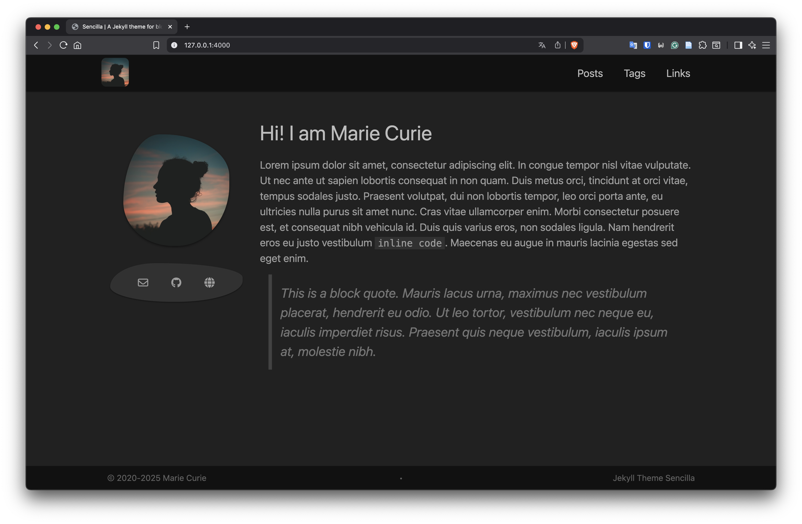

# Sencilla

[](https://badge.fury.io/rb/sencilla)

A Jekyll theme for blogs and portfolio websites.



## Installation

Add this line to your Jekyll site's `Gemfile`:

```ruby
gem "sencilla"
```

And add this line to your Jekyll site's `_config.yml`:

```yaml
theme: sencilla
```

And then execute:

    $ bundle

Or install it yourself as:

    $ gem install sencilla

## Usage

Will be added soon.

## Contributing

Bug reports and pull requests are welcome on GitHub at https://github.com/dyskun/sencilla/.

## License

This theme is available under the terms of [MIT License](https://opensource.org/licenses/MIT).

## Credits

- Sencilla is a fork of [Minima](https://github.com/jekyll/minima) v2.5.1. 
- I took `tags.html` from [beautiful-jekyll](https://github.com/daattali/beautiful-jekyll) and the color tones from [open-color](https://github.com/yeun/open-color) and [material.io](https://material.io). 
- Source of `/assets/img/profile-picture.jpg`: [Pexels.com](https://www.pexels.com/photo/silhouette-photo-of-person-during-golden-hour-2475138/)

